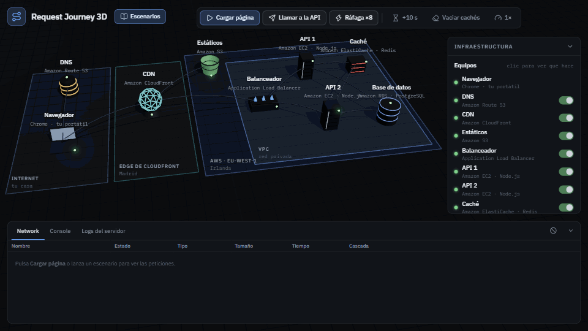
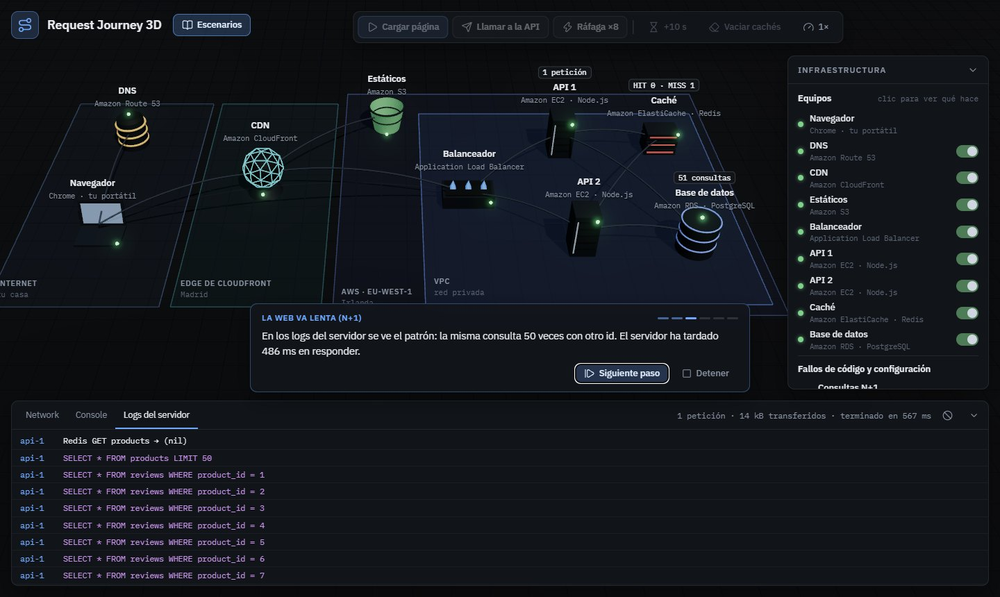
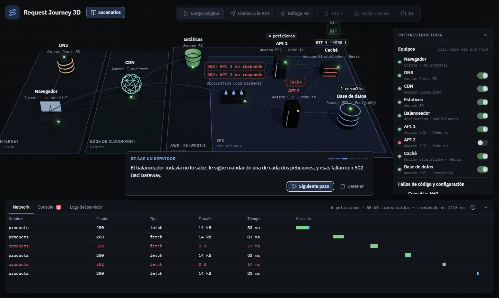
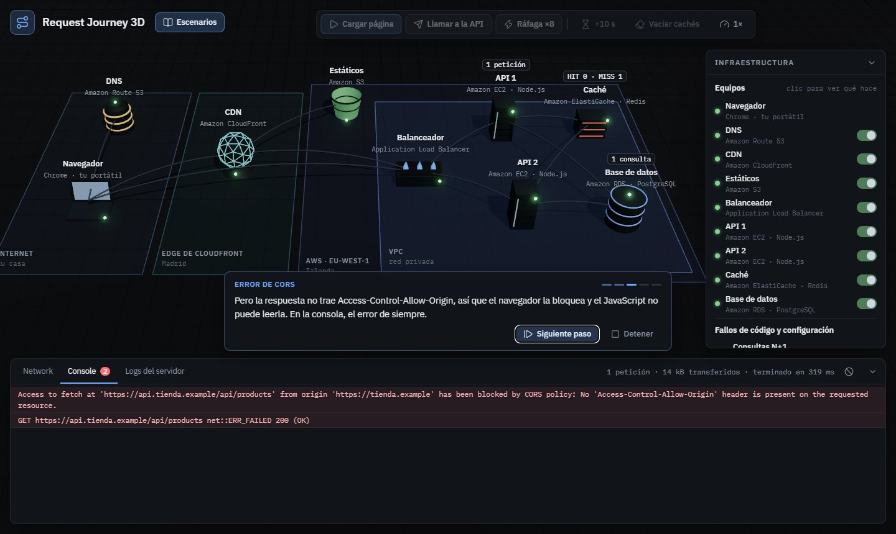
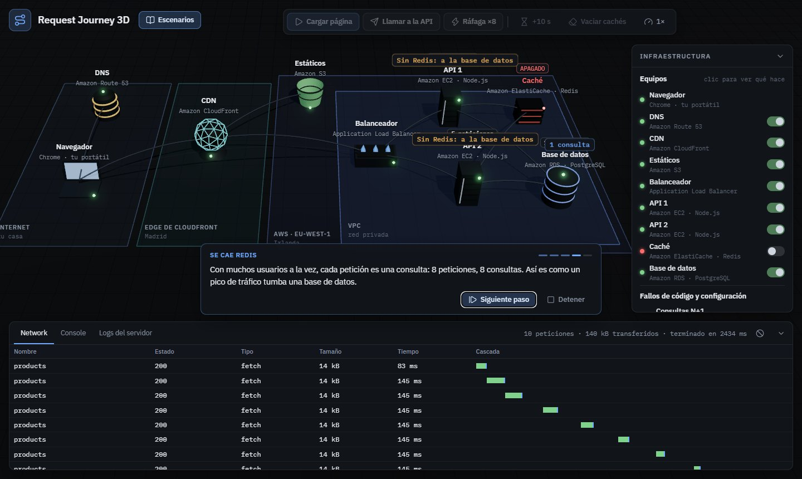
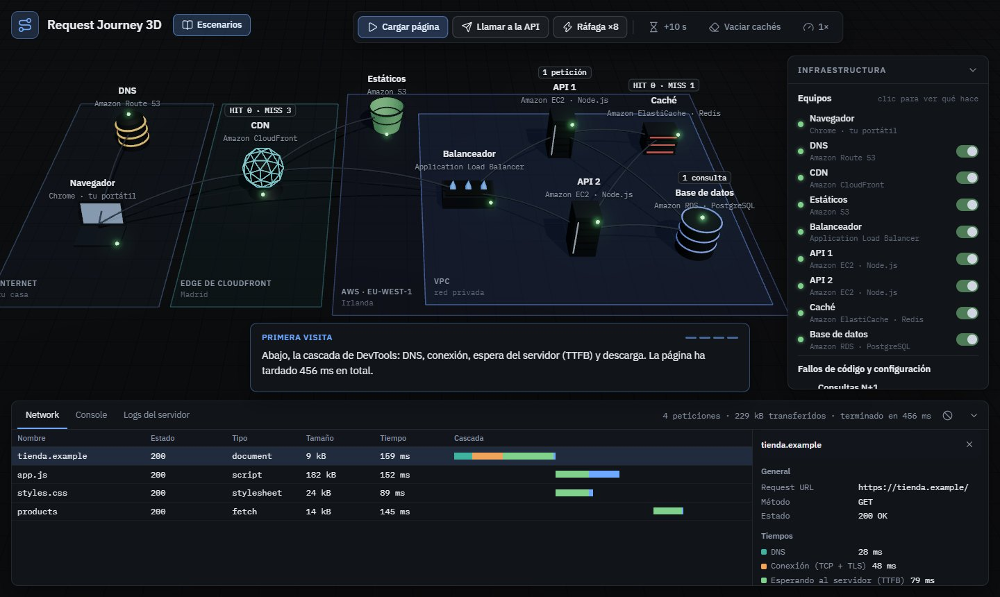
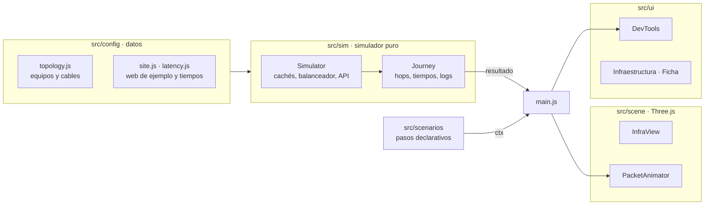

# Request Journey 3D

Qué pasa desde que escribes una dirección en el navegador hasta que la base de datos responde, visto en 3D. La petición viaja por el DNS, la CDN, el balanceador, los servidores de la API, la caché y la base de datos, mientras unas DevTools como las de Chrome muestran la cascada de tiempos, la consola y los logs del servidor. Incluye escenarios guiados con las averías típicas de producción: la web va lenta por un N+1, se cae Redis, se cae un servidor, error de CORS, 429…

[](https://github.com/arnaucanet/request-journey/actions/workflows/ci.yml)
[](https://github.com/arnaucanet/request-journey/actions/workflows/deploy.yml)

**Demo:** https://arnaucanet.github.io/request-journey/



## Qué es

Un proyecto para entender (y enseñar) el recorrido completo de una petición web en una arquitectura típica de AWS, juntando dos mundos: el desarrollo web que uso a diario y la infraestructura cloud que estoy aprendiendo. No es una animación pregrabada: un simulador calcula qué le pasa a cada petición en cada equipo, y la escena 3D solo reproduce ese resultado.

- **Infraestructura realista**: DNS (Route 53), CDN (CloudFront) delante de S3, balanceador (ALB) con health checks, dos instancias EC2 con la API, caché Redis (ElastiCache) y base de datos PostgreSQL (RDS).
- **Cachés de verdad**: caché de disco del navegador, caché DNS, conexiones reutilizadas, HIT/MISS en CloudFront con su cabecera `x-cache` y Redis con caducidad de 60 s.
- **DevTools**: pestaña Network con la cascada (DNS, conexión TCP + TLS, TTFB y descarga) y las cabeceras de cada petición, Console con los errores tal como los escribe Chrome, y los logs de los servidores con cada consulta SQL.
- **Averías**: se puede apagar cualquier equipo y activar fallos de código (N+1, CORS, límite de peticiones) desde el panel.
- **7 escenarios guiados** con subtítulos, de corrido o paso a paso, y enlazables (`?escenario=cors`).

## Escenarios

| Escenario                  | Qué se ve                                                                                                                                                    |
| -------------------------- | ------------------------------------------------------------------------------------------------------------------------------------------------------------ |
| Primera visita             | Cachés vacías: consulta DNS, conexión TCP + TLS, MISS en la CDN (que va a S3), el JS y el CSS en paralelo y la API hasta la base de datos. **456 ms**.       |
| Segunda visita             | La IP y la conexión ya están en el navegador, la CDN da HIT, el JS y el CSS salen de la caché de disco y la API de Redis. **113 ms**.                        |
| La web va lenta (N+1)      | Una petición genera 1 + 50 = **51 consultas** (486 ms de espera). Redis lo esconde en la segunda petición. Con un JOIN: 1 consulta y 140 ms.                 |
| Se cae Redis               | La API captura el `ECONNREFUSED` y sigue respondiendo, pero cada petición va a la base de datos: 8 peticiones, 8 consultas. Al volver, Redis está vacío.     |
| Se cae un servidor         | El balanceador sigue mandando una de cada dos peticiones a la instancia caída (**502 Bad Gateway**) hasta que 2 health checks seguidos la sacan del reparto. |
| Error de CORS              | La API pasa a `api.tienda.example`. El servidor responde 200, pero el navegador bloquea la respuesta. Se arregla con `Access-Control-Allow-Origin`.          |
| Límite de peticiones (429) | 8 peticiones seguidas: 5 pasan y 3 reciben **429 Too Many Requests** con `Retry-After`. Al pasar 10 s, vuelve a responder.                                   |

Cada escenario se ejecuta también sin navegador en [`tests/scenarios.test.js`](tests/scenarios.test.js), que comprueba con el simulador lo que dicen sus subtítulos: que salen exactamente 51 consultas, que la segunda visita es más de 3 veces más rápida, que el health check necesita dos fallos…

## Capturas

| La web va lenta (N+1)                                                                     | Se cae un servidor                                                                                                   |
| ----------------------------------------------------------------------------------------- | -------------------------------------------------------------------------------------------------------------------- |
|  |  |
| **Error de CORS**                                                                         | **Se cae Redis**                                                                                                     |
|                    |                                   |



## Servicios de AWS que aparecen

| Servicio                      | Papel en la escena                                    | Qué se aprende                                                                |
| ----------------------------- | ----------------------------------------------------- | ----------------------------------------------------------------------------- |
| **Route 53**                  | DNS: traduce `tienda.example` a una IP                | El primer paso de cualquier visita, y por qué la segunda vez ya no hace falta |
| **CloudFront**                | CDN en un edge cercano (Madrid)                       | HIT y MISS, la cabecera `x-cache` y por qué la API no se cachea en la CDN     |
| **S3**                        | Origen de los archivos estáticos                      | Solo se le pregunta cuando la CDN no tiene el archivo                         |
| **Application Load Balancer** | Reparte por round robin entre las instancias          | Health checks, umbrales y de dónde sale un 502 o un 503                       |
| **EC2**                       | Dos instancias con la API en Node.js                  | Redundancia: si cae una, la otra aguanta con la mitad de capacidad            |
| **ElastiCache (Redis)**       | Caché de la respuesta de la API durante 60 s          | Cuánto ahorra una caché y qué pasa cuando desaparece                          |
| **RDS (PostgreSQL)**          | Base de datos con productos y reseñas                 | Es lo más lento del recorrido; el N+1 y la carga cuando falla la caché        |
| **VPC**                       | Red privada donde viven balanceador, API, Redis y RDS | Qué está expuesto a Internet y qué no                                         |

## Cómo se usa

| Acción                      |                                                                        |
| --------------------------- | ---------------------------------------------------------------------- |
| **Cargar página** (`L`)     | Visita completa: HTML, JS y CSS en paralelo y la llamada a la API      |
| **Llamar a la API** (`A`)   | Solo `GET /api/products`                                               |
| **Ráfaga ×8**               | 8 llamadas seguidas, para ver el reparto del balanceador o el 429      |
| **+10 s**                   | Avanza el reloj: el balanceador hace su health check                   |
| **Vaciar cachés**           | Navegador, CDN y Redis, como un despliegue nuevo visitado en incógnito |
| Clic en un equipo           | Qué hace, en qué servicio de AWS vive y sus contadores                 |
| Clic en una fila de Network | Tiempos y cabeceras de esa petición                                    |

## Arquitectura

El código está separado en capas: el simulador no sabe que existe Three.js y la escena no toma ninguna decisión.



1. `Simulator.fetch()` calcula de forma síncrona todo lo que le pasa a una petición: qué cachés acierta, a qué servidor la manda el balanceador, qué consultas hace la API… El resultado es un objeto con sus **hops** (cada tramo que recorre un paquete), la **cascada de tiempos**, las **cabeceras**, los **logs** y los mensajes de **consola**.
2. Entre los hops van **marcas** (HIT, MISS, 502, 51 consultas…) que decide el simulador y la escena muestra como notas flotantes justo cuando el paquete llega a ese equipo.
3. `PacketAnimator` reproduce los hops por los cables. Mientras viaja, la fila de Network aparece como _(pendiente)_; al volver el paquete se completa con los tiempos reales calculados.
4. Un escenario es una lista de pasos `{ caption, run(ctx) }` que solo actúa a través de un contexto (lanzar peticiones, apagar equipos, activar fallos, mover la cámara). En el navegador ese contexto anima la escena; en los tests es instantáneo.

```
src/
├── config/      topología, web de ejemplo, latencias y posiciones en la escena
├── core/        Emitter: eventos entre capas
├── sim/         simulador y recorrido de cada petición
├── scene/       Three.js: equipos, zonas, cables, paquetes, notas y selección
├── scenarios/   escenarios declarativos y su runner
├── ui/          DevTools, panel de infraestructura, ficha, acciones, subtítulos
└── main.js      crea las piezas y las conecta
tests/           Vitest: simulador y escenarios completos
```

## Decisiones y simplificaciones

- **Todo es determinista**: con el mismo estado, una petición siempre da el mismo resultado y los mismos milisegundos. Por eso los subtítulos pueden decir "456 ms" y un test comprobarlo.
- **Latencias típicas, no medidas**: lo que importa es la proporción (la CDN está cerca, la base de datos es lo más lento). Están todas en [`src/config/latency.js`](src/config/latency.js).
- **Dominios e IPs de documentación** (`tienda.example`, `203.0.113.10`), reservados para ejemplos por los RFC 2606 y 5737.
- **Simplificaciones asumidas**: el reloj solo avanza con las peticiones y con "+10 s", que es cuando el balanceador hace sus health checks; los umbrales del health check son 2 y 2 (en AWS el de recuperación es 5 por defecto); el contador del límite de peticiones es compartido por las dos instancias (en la realidad iría en Redis); la conexión usa TLS 1.3 (una ida y vuelta).

## Ejecutarlo

Requiere Node.js 20 o superior.

```bash
npm install
npm run dev        # http://localhost:5192
```

| Script           |                                |
| ---------------- | ------------------------------ |
| `npm test`       | Tests (Vitest)                 |
| `npm run lint`   | ESLint                         |
| `npm run format` | Prettier                       |
| `npm run build`  | Build de producción en `dist/` |

Cada push a `main` pasa formato, lint, tests y build en GitHub Actions y, si todo va bien, se despliega en GitHub Pages.

## Tecnologías

- **JavaScript** con módulos ES, sin framework.
- **Three.js** (r186): modelos low-poly hechos con primitivas, `CSS2DRenderer` para las etiquetas, sombras y post-procesado con bloom.
- **Vite**, **Vitest**, **ESLint** y **Prettier**.
- Iconos de **Lucide** y tipografías **IBM Plex Sans / Mono**.
- **GitHub Actions** y **GitHub Pages**.

## Licencia

[MIT](LICENSE)
